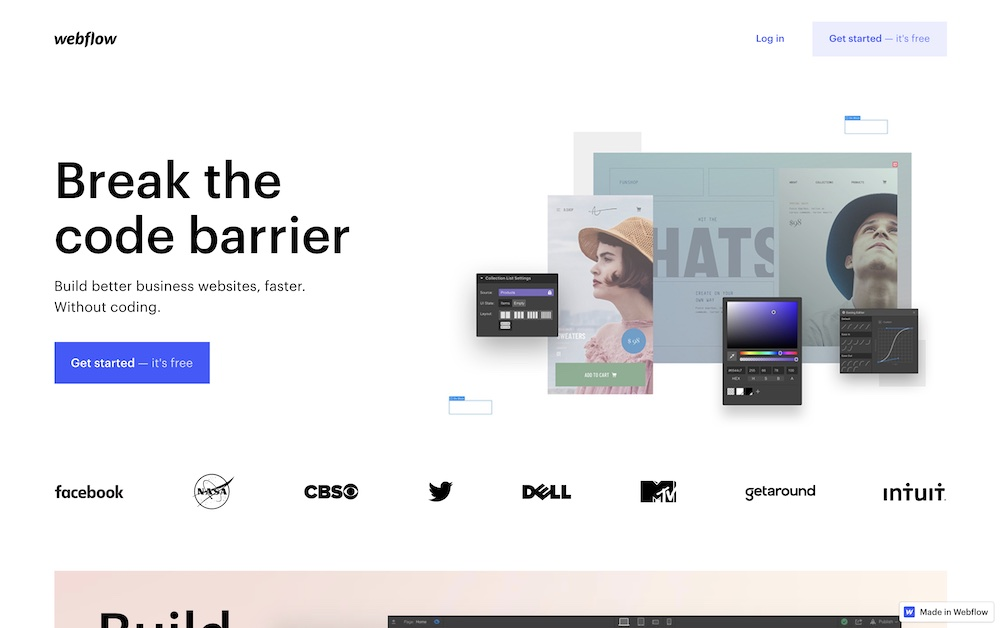
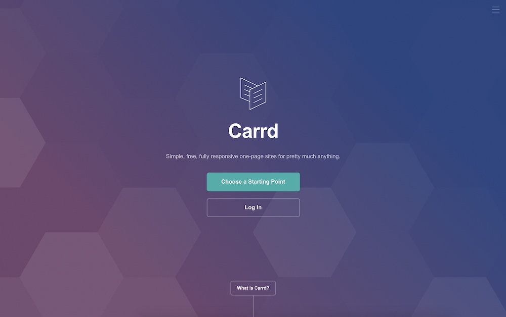
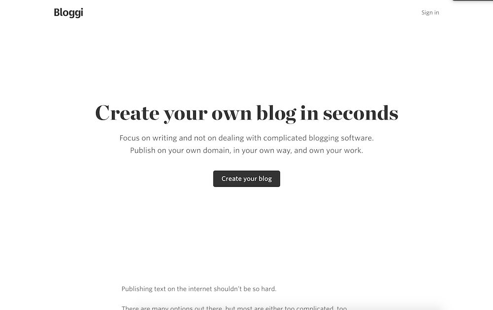

What is the best platform to build and host your website?

Like most things, this isn't a simple answer. In other words, it depends.

But I'm not going to leave you hanging.

These are my top recommendations for web platforms based on _your_ capabilities:

1. [Webflow](https://www.webflow.com  "Webflow's Homepage") - if you have some design skills or any familiarity with HTML/CSS
2. [Carrd](https://carrd.co/ "Carrd's Homepage") - if you need a simple site or a landing page, minimal design skills required
3. [Bloggi](https://bloggi.co/ "Bloggi's Homepage") - if you just need a blog

## Webflow - The best all-around website builder and host with no coding required

Let's put it this way. I'm a web developer by profession, and I still build some client's websites on [Webflow](https://www.webflow.com  "Webflow's Homepage").

_Why?_

Because Webflow is a great experience for my clients _AND_ for me.

The team has built a platform designed specifically for building websites without code.

There are templates to use if you don't want to spend time designing.

And you have complete design control over the elements you want to really fine-tune.

You can host your site directly through their dashboard, receive form submissions, add ecommerce, and so much more.

If you're on Wordpress, Squarespace, Wix or one of those other builders, you owe it to yourself to check out Webflow.

## Carrd - Simple, responsive, inexpensive web pages for pretty much anything

If you're not looking for a full-blown site, or don't want to spend a lot of time designing, [Carrd](https://carrd.co/ "Carrd's Homepage") is a great choice.

It's free to get started, and you only need to pay when you add a custom domain or want some additional functionality.

And upgrading only costs between $9 and $99 per year, depending on which features you want to add (and the number of sites you need).

Pick a template, customize it, add your content, and get it live.

It really is that simple.

## Bloggi - A simple, beautiful, minimal blog for a low price with nothing you don't need

I discovered [Bloggi](https://bloggi.co/ "Bloggi's Homepage") recently, and I'm incredibly impressed with it.

It's simple (and free) to get started and see your site.

And then you can upgrade to use a custom domain, have pages other than blog posts, and a few other features.

And by "upgrade" I mean $29/year. You read that right. Per *year*.

If you just want to start writing and getting content out, this is exactly how you do it.

It's more important to have your content out there than it is to have a branded site you don't want to update.

(If you don't believe me about content taking priority, [check out this article by Justin Jackson](https://justinjackson.ca/words.html))

So basically, you have no excuse. If you're frustrated with the complexity of other tools, just use Bloggi and get your content out there.

## What's your website platform pick?

If you've built a website (or page) on one of these platforms, share it with me [@morganandrewv on Twitter](https://www.twitter.com/morganandrewv).

If you're using something else, let me know what it is and what you like (or don't like!) about it.

Now get creating on your site!
