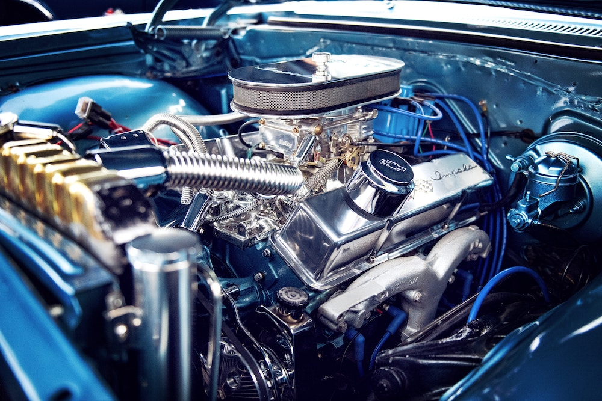

You know how important content is for your business.

You've been meaning to create content for a long time. It's always on your to do list... but never gets done.

Where do you start?

What kind of content do you produce?

Should you blog? Podcast? Create videos?

If you do any of those... how do you do it?

Decision fatigue sets in. And you never start creating. Or you do once or twice, and then stop.

But you know the longer you put it off, the more difficult it will be to catch up. A content library is one of the best things you can have to help your audience, deliver on your value proposition, and showcase your expertise.

You need a content engine.

## What Is A Content Engine?

Your content doesn't have to live in a silo.

By leaning in to your preferred content type and converting that into different mediums, you've created a content engine for yourself.

A content engine is a creation machine that takes one content medium as input and produces multiple variations from it.

Do you enjoy writing? Trying recording a video summary of your latest post.

Do you podcast? Make sure you're getting your episodes transcribed.

Do you prefer video? Dig into a detail of your latest video in a text article.

This may take some fine-tuning to figure out what your preferred medium is and how best to convert it for you.

Do not get discouraged if you try something that isn't working for you!

## Share Your Content After You Create It

Your content engine isn't going to do any good sitting in your garage.

Even if it starts with just a small circle of friends, you'll get valuable feedback and you'll have a library for the future.

So get creating and sharing!

[Email](mailto:morgan@morganvanderleest.com) or [tweet me](https://www.twitter.com/morganandrewv) and I'll share yours too.
